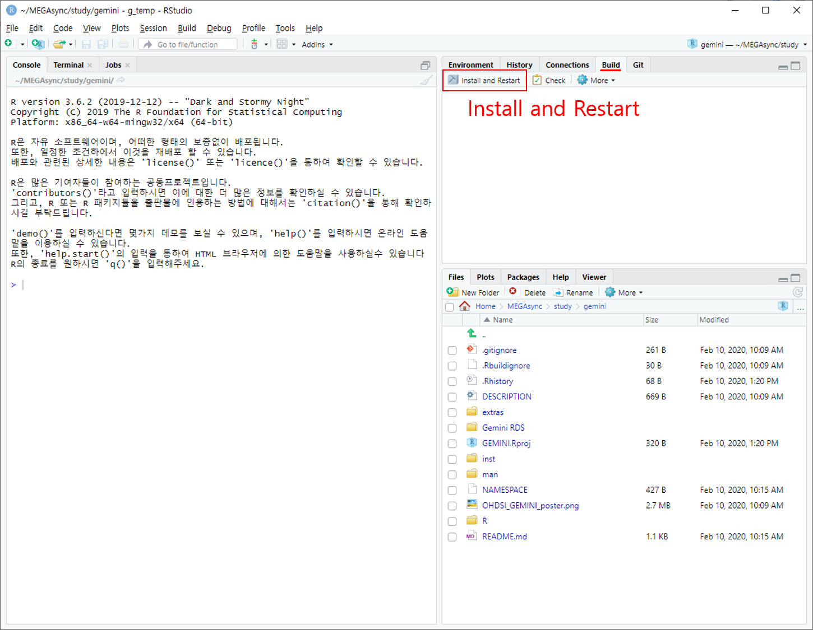
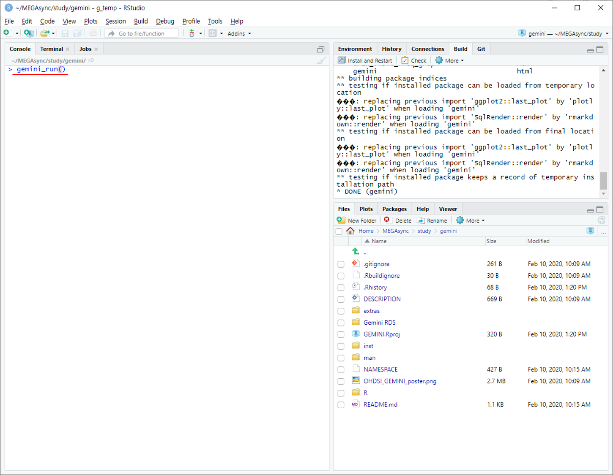
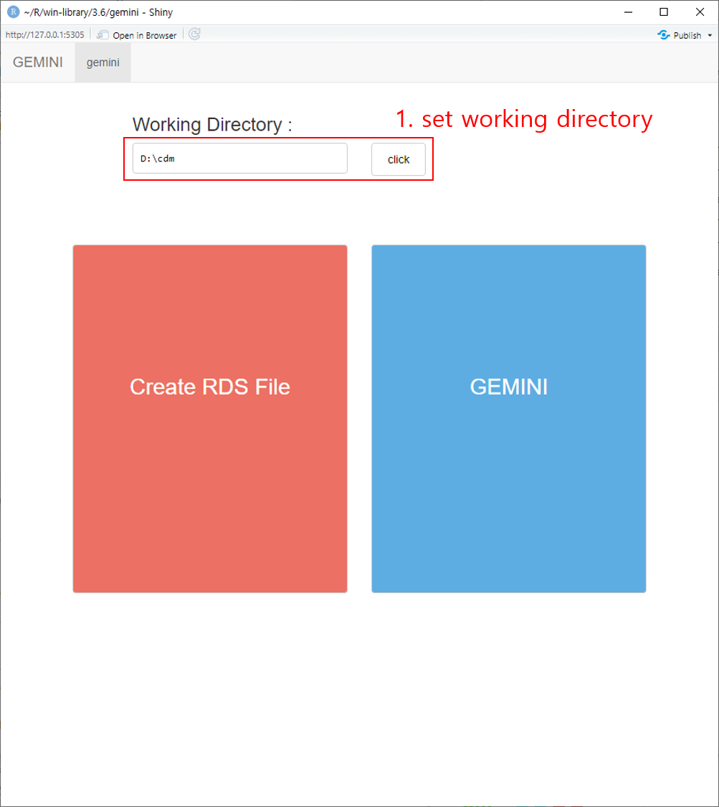
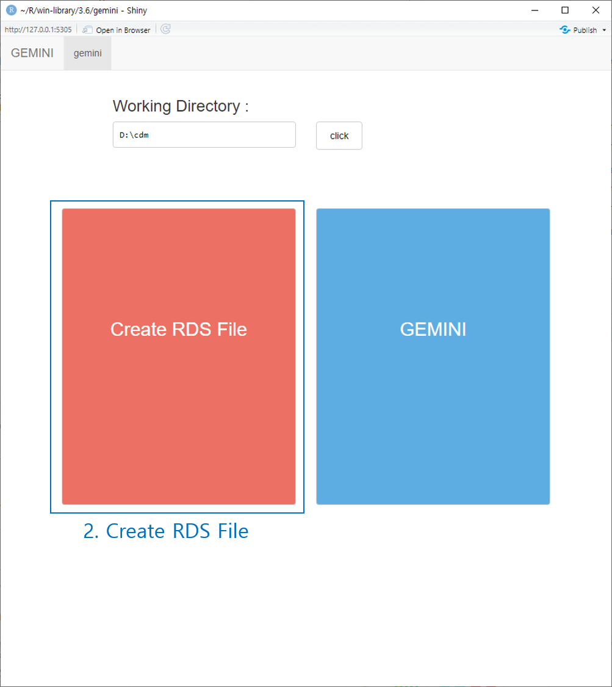
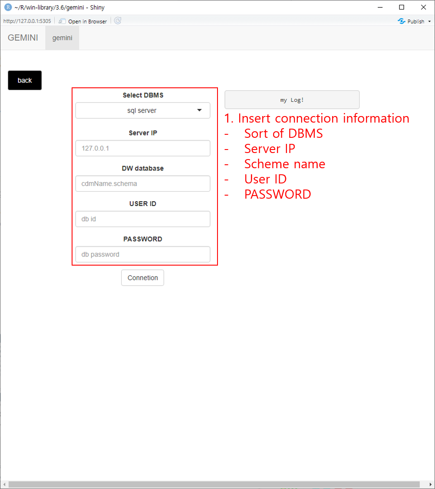
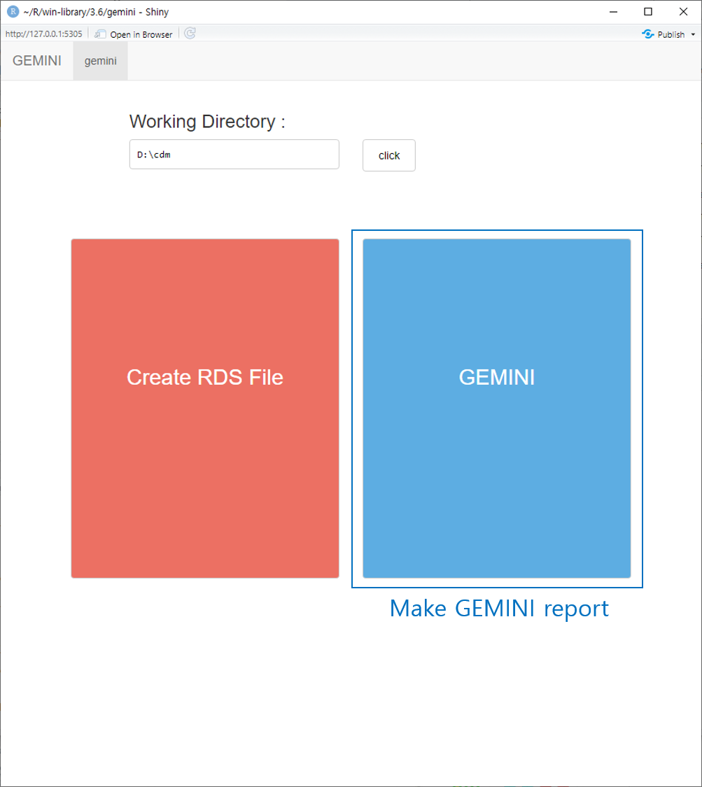
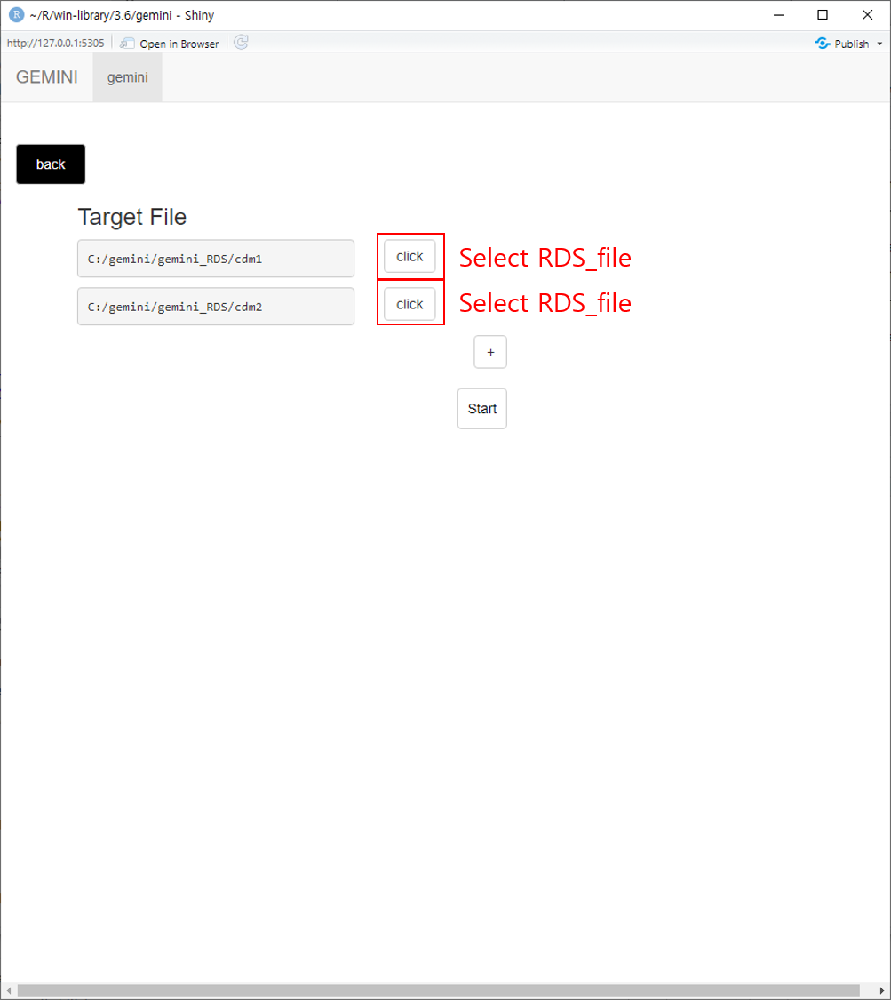
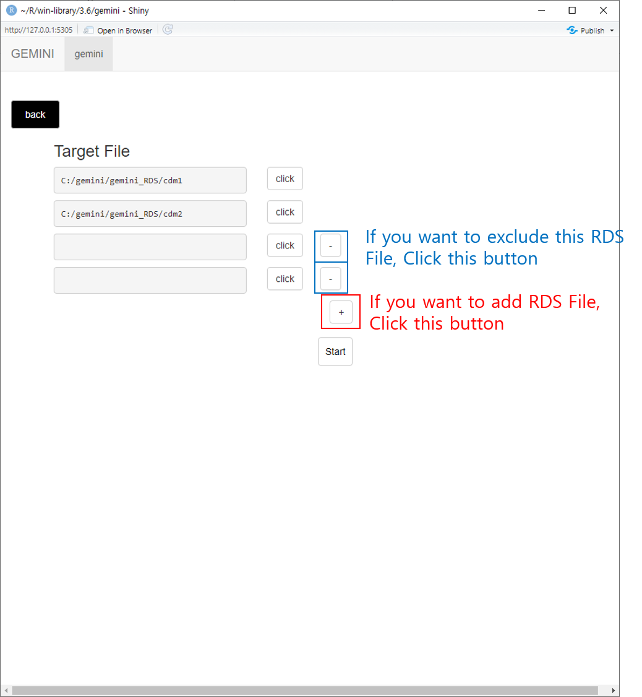
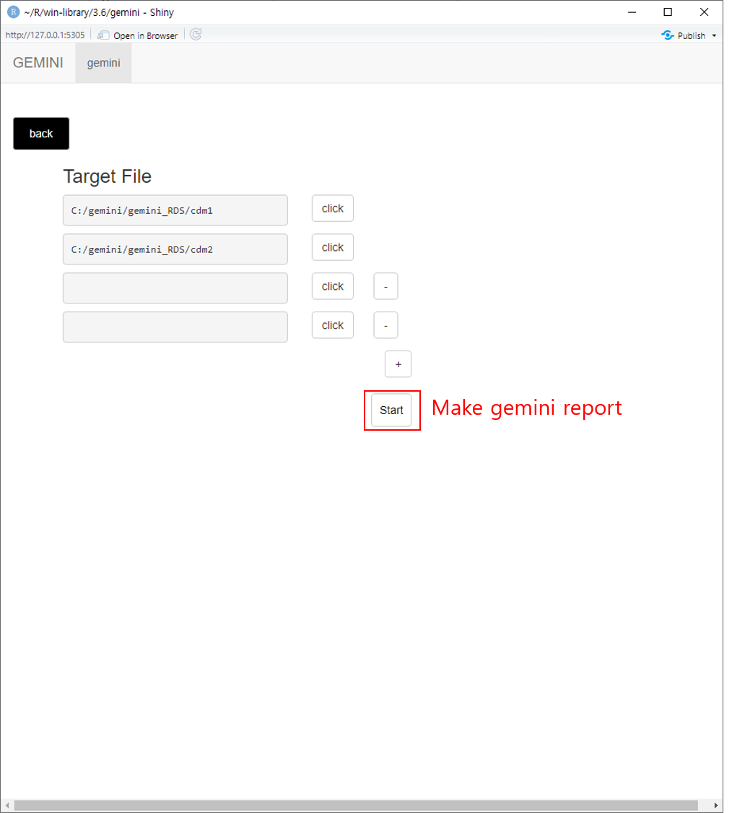

# How to install GEMINI

## index
- Requirement
- Tool
	- Rstudio Work
	- Create RDS Files
	- Make Report

## Requirement
- JDK(set PATH)
- Rstudio
- Rtools([set PATH](https://github.com/ABMI/GEMINI/archive/g_temp.zip))
- R packages

## Tool
### Rstudio Work
- Download [GEMINI R project](https://github.com/ABMI/GEMINI/archive/g_temp.zip)
- Run "GEMINI.Rproj"
- go to "Build" tap - click "Install and Restart"

- run code `gemini_run()`

### Create RDS Files
- set work directory

- create RDS

- input connection information

### Make Report
- select GEMINI

- select RDS File

- add or abstract RDS File

- make report

